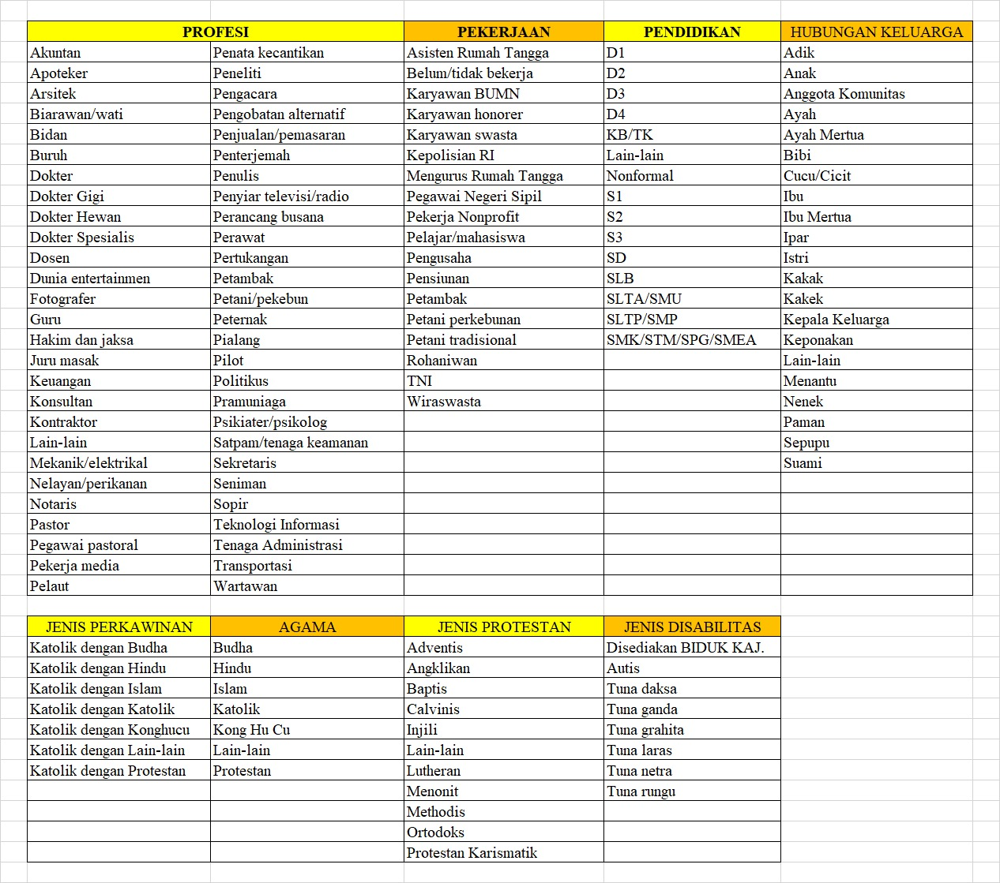

# Panduan Penggunaan BIDUK Bagi Pengurus Lingkungan Sathora

Dokumen ini disusun untuk menjelaskan garis besar penggunaan BIDUK terkait kegiatan sensus umat Sathora 2022. Termasuk beberapa prosedur operasi standar yang sering dihadapi pengurus lingkungan dalam melayani data umat lingkungannya. 

Dokumen ini tidak mencakup kebijakan, pertimbangan menentukan pilihan prosedur pelayanan data umat yang dilakukan baik oleh pengurus lingkungan dan petugas sekretariat gereja. 
Dokumen ini tidak menjelaskan kolom data yang sebaiknya diisi. BIDUK menandai kolom data wajib isi dengan tanda bintang setelah nama kolom. 

Pengurus lingkungan yang akan menggunakan BIDUK sebaiknya memiliki kemampuan menggunakan komputer dasar seperti menggunakan *browser*; aplikasi *spreadsheet*: Microsoft Excel, Google Sheet.

Versi 220321-2008. Lihat <a href="#riwayat-perubahan">riwayat perubahan</a>.

## Indeks

1. <a href="#istilah" alt="Istilah">Istilah</a>
2. <a href="#skenario" alt="Skenario">Skenario</a>
3. <a href="#prosedur" alt="Prosedur">Prosedur</a>
4. <a href="#user-manual-biduk" alt="User manual BIDUK">User manual BIDUK</a>
5. <a href="#kondisi-saat-ini" alt="Kondisi saat ini">Kondisi saat ini</a>
6. <a href="#menu-biduk" alt="Menu BIDUK">Menu BIDUK</a>
7. <a href="#tips" alt="Tips">Tips</a>
8. <a href="tanya-jawab" alt="Tanya jawab">Tanya jawab</a>
9. <a href="#predefined-values" alt="Predefined values">Predefined Values</a>
10. <a href="#excel-data-umat" alt="Excel Data Umat">Excel Data Umat</a>
11. <a href="#narahubung" alt="Narahubung">Narahubung</a>

## Istilah

Perlunya untuk menyamakan penggunaan istilah yang sering digunakan:

- BIDUK 

    * Basis Integrasi Data Umat Keuskupan sebuah sistem daring pencatatan data umat yang dibangun Keuskupan Agung Jakarta (KAJ). 
    * Sistem ini dapat diakses menggunakan perambah (browser) yang terhubung internet. 
    * Rekomendasi perambah adalah Google Chrome versi terbaru. 
    * Alamat akses BIDUK adalah <a href="https://biduk.or.id" alt="https://biduk.or.id" target="_blank">https://biduk.or.id</a>. 
    * Pengurus lingkungan berinteraksi dengan BIDUK terkait data umat nonsakramental dan sakramental terbatas (baptis & komper, krisma, perkawinan). Sakramental terbatas di sini maksudnya sakramen yang diterima umat sebelum sistem BIDUK SAKRAMEN mulai digunakan. 
    * Petugas sekretariat gereja mengelola data umat sakramental.
    * ~~Petugas sekretariat gereja klaim mutasi umat antarlingkungan beda wilayah dalam Sathora, dan antarparoki.~~
    * Otorisasi BIDUK yang diberikan kepada pengurus lingkungan adalah lihat dan simpan. Karenanya, segala hal berkaitan dengan penghapusan data, pengurus lingkungan wajib hubungi petugas sekretariat gereja.
    * Setiap lingkungan diberikan sebuah *username* untuk masuk ke dalam BIDUK. Silakan digunakan oleh pengurus lingkungan, bukan oleh umat. 
    * Jika pergantian pengurus lingkungan, *username* tetap sama. Pengurus baru lingkungan cukup mengganti *password*.

- BIDUK SAKRAMEN

    * Fitur BIDUK untuk memperbarui data sakramen umat lintas paroki yang tercatat pada BIDUK setelah menerima sakramen yang diselenggarakan sebuah paroki sejak fitur ini tersedia. 
    * Petugas sekretariat gereja akan menerima notifikasi umat parokinya yang telah menerima sakramen.
    * Pengurus lingkungan dapat melayani data sakramen umatnya yang belum tercatat atau keliru catat pada BIDUK.
    
- Kartu Keluarga BIDUK

    * Kartu Keluarga atau KK BIDUK adalah kartu yang merujuk kepada sebuah keluarga unik yang tercatat pada BIDUK. 
    * Sebuah keluarga BIDUK terdiri dari minimal satu orang anggota keluarga beragama Katolik. 
    * KK BIDUK mencatat semua anggota keluarga apapun agamanya.
    * Salah seorang anggota keluarga dipilih sebagai kepala keluarga pada KK BIDUK.
    * KK BIDUK hanya dibikin satu kali dan bisa dipindah atau dimutasi ke lingkungan atau paroki lain jika keluarga yang bersangkutan berpindah domisili.
    * Analogi KK BIDUK adalah kartu keluarga yang diterbitkan pemerintah.
    * KK BIDUK diberi nomor yang dikenal sebagai Kode KK BIDUK atau Kode KK, yang berformat huruf kapital 'K' diikuti 9 angka tanpa spasi antaranya.
    * Setiap anggota keluarga pada KK BIDUK yang sama memiliki Kode KK sama.
    * Jika kepala keluarga berhalangan tetap, salah satu anggota keluarga lainnya dipilih menggantikannya.
    * KK BIDUK dapat dicetak (hardcopy) jika umat memerlukannya.
    * KK BIDUK dapat dihapus oleh petugas sekretariat gereja. Contoh pada skenario KK BIDUK ganda ditemukan.

- Nomor Anggota

    * Setiap anggota keluarga yang tercata pada KK BIDUK diberi nomor yang disebut Nomor Anggota atau Nomor Umat, yang berformat huruf kapital 'A' diikuti 9 angka tanpa spasi antaranya.
    * Analogi Nomor Anggota adalah Nomor Induk Kependudukan atau NIK atau nomor KTP yang diterbitkan pemerintah.
    * Anggota selalu menempel pada satu spesifik KK BIDUK. 
    * Setiap anggota keluarga memiliki 2 nomor yaitu Kode KK dan Nomor Anggota.
    * Setiap anggota keluarga yang akan ditambahkan ke BIDUK akan divalidasi NIK-nya guna hindari data ganda.
    * Anggota keluarga bisa keluar dari KK BIDUK-nya, lalu membuat KK BIDUK baru. Contoh anak membuat KK BIDUK baru terpisah dari orangtuanya setelah menikah meskipun tetap tinggal sealamat.
    * Anggota keluarga bisa keluar dari KK BIDUK-nya pindah ke lingkungan atau paroki lain. Bisa bergabung dengan KK BIDUK yang sudah ada di tempat baru atau bikin KK BIDUK baru.
    * Anggota keluarga bisa masuk bergabung KK BIDUK yang sudah ada.
    * Anggota keluarga yang berhalangan tetap perlu dicatat tanggal meninggalnya supaya namanya tidak muncul pada sistem lain seperti Web Bela Rasa. Pun tidak tercetak pada KK BIDUK.
    * Nomor Anggota tidak tercetak pada KK BIDUK (hardcopy). Namun, tersedia pada hasil cetak anggota (hardcopy) pojok kanan atas.
    * Anggota KK BIDUK dapat dihapus oleh petugas sekretariat gereja. Contoh pada skenario anggota KK BIDUK ganda ditemukan.
 
- Nomor BIDUK

    * Istilah ini jangan digunakan karena memiliki arti ganda. Bisa berarti Kode KK atau Nomor Anggota.
    * Tidak ditemukan pada BIDUK.

<a href="#indeks" alt="Kembali ke Indeks">^ Kembali ke Indeks</a>

## Skenario

Berikut beberapa kemungkinan skenario terkait BIDUK. Tidak menutup skenario lain yang belum tertulis di bawah ini:

- Penambahan KK BIDUK

    * Umat belum pernah tercatat pada BIDUK baik di Sathora maupun paroki lain.
    * Anggota keluarga yang memisahkan diri dari KK tempat yang bersangkutan sudah tercatat.

- Perubahan KK BIDUK

    * Pindah alamat domisili masih dalam lingkungan yang sama.
    * Revisi penulisan alamat domisili.
    * Pergantian kepala keluarga.

- Pemindahan KK BIDUK

    * Sekeluarga pindah keluar domisili ke lingkungan baru dalam Sathora, atau ke luar Sathora.
    * Sekeluarga pindah masuk domisi ke lingkungan.
    * Sekeluarga sudah pindah tanpa lapor ke pengurus lingkungan. Jenis mutasinya lingkungan. Jika suatu hari diketahui pindah lingkungan beda wilayah atau paroki lain, klaim mutasi dulu lalu mutasi kembali dengan jenis sesuai.

- Penambahan Anggota KK BIDUK

    * Kelahiran anggota keluarga.
    * Kedatangan anggota keluarga dari lingkungan lain atau luar paroki.

- Perubahan Anggota KK BIDUK

    * Penambahan atau revisi data umat bersifat statis seperti NIK, nama baptis, nama resmi sesuai KTP, tempat & tanggal lahir.
    * Pergantian data umat bersifat dinamis seperti alamat email, nomor ponsel.

- Pengurangan Anggota KK BIDUK

    * Anggota keluarga meninggal atau berhalangan tetap.
    * Anggota keluarga pindah ke lingkungan lain atau luar paroki karena pindah domisili, menikah.

- Pencatatan data vaksin

    * Anggota keluarga laporkan data vaksinnya ke gereja.

- Ekspor data umat lingkungan

    * Tarik data umat lingkungan keluar dari BIDUK ke dalam bentuk Excel (.xlsx) untuk pengurus lingkungan kelola lebih lanjut.

<a href="#indeks" alt="Kembali ke Indeks">^ Kembali ke Indeks</a>

## Prosedur

- <a href="kartu-keluarga" alt="Prosedur KK BIDUK">KK BIDUK</a>
- <a href="anggota-keluarga" alt="Prosedur anggota KK BIDUK">Anggota KK BIDUK</a>
- <a href="data-vaksin" alt="Prosedur data vaksin">Data vaksin</a>
- <a href="ekspor-data" alt="Prosedur ekspor data umat lingkungan">Ekspor data umat lingkungan</a>

<a href="#indeks" alt="Kembali ke Indeks">^ Kembali ke Indeks</a>

## User manual BIDUK

<a href="docs/BIDUK-KAJ-untuk-Admin-Paroki-v1.26.0-220118-lowres.pdf" target="_blank" alt="User Manual BIDUK">User manual BIDUK versi 1.26.0 tanggal 18/01/2022 (low resolution 72 dpi)</a>.

<a href="#indeks" alt="Kembali ke Indeks">^ Kembali ke Indeks</a>

## Kondisi Saat Ini

- Terdapat KK BIDUK ganda beranggotakan umat sama. 
- NIK Anggoa KK BIDUK kosong (belum tercatat di BIDUK) atau salah ketik (typo) baik kekeliruan petugas *data entry* atau dari umat sendiri. Salah data juga sering terjadi pada tempat dan tanggal lahir.
- Jika umat tidak ditemukan pada KK BIDUK, Anggota KK BIDUK, coba cari pada daftar mutasi sebelum input baru.
- Umat tunjukkan *hardcopy* KK BIDUK tapi datanya tidak ditemukan pada BIDUK. 

## Tips

- Buka menu BIDUK sebagai tab baru pada *browser*.
- Manfaatkan fitur Grup Kriteria Pencarian untuk mempercepat tampilan kriteria pencarian yang sering digunakan. Contoh pencarian data umat berdasarkan nama yang mengandung potongan nama.
- Lebih baik Kode KK disosialisasikan agar umat terbiasa menggunakannya ketika mereka mengurus administrasi gereja. Kode KK tercetak pada KK BIDUK *hardcopy*. Saat ini Kode KK dan NIK digunakan Tim Admin Belarasa membantu mendaftarkan umat, bukan Nomor Anggota.
- Berhati-hatilah menyimpan unduhan hasil ekspor data KK BIDUK dan Anggota KK BIDUK. Di dalamnya tersimpan data sensitif tanpa proteksi.
- Hindari banyak pengurus lingkungan yang dapat mengakses BIDUK. Semakin banyak orang, semakin mudah data menyebar. 
- Hindari BIDUK diakses menggunakan *public WiFi* tempat umum.
- Pengurus lingkungan ~~sebaiknya~~ wajib menyerahkan kembali blangko yang telah diisi berserta semua lampirannya ke umat pemohon~~petugas sekretariat gereja untuk diarsip terpusat~~. Hindari diarsip sendiri, diserahterimakan kepada pengurus lingkungan berikutnya.
- Blangko yang telah diisi tapi batal digunakan sebaiknya dihancurkan agar tidak disalahgunakan.
- Banyak jalan menuju Roma. Untuk akses Anggota KK BIDUK bisa langsung cari gunakan nama, NIK, tanggal lahir; atau melalui KK BIDUK-nya gunakan Kode KK.
- Gunakan komputer PC atau laptop buat akses BIDUK. Hindari gunakan smartphone. Sayangilah mata Anda.

<a href="#indeks" alt="Kembali ke Indeks">^ Kembali ke Indeks</a>

## Menu BIDUK

Berikut pilihan menu yang pengurus lingkungan akan lihat setelah berhasil masuk BIDUK (mulai paling kiri):

1. Data Utama

      Berisi submenu konfigurasi dan predefined values yang telah disiapkan.

2. Form

      Berisi submenu pembuatan KK BIDUK baru, pencetakan multi (anggota) KK BIDUK, klaim mutasi (anggota) KK BIDUK.

3. Pencarian

      Berisi submenu pencarian data (anggota) KK BIDUK sesuai kriteria tertentu, pencarian data mutasi (anggota) KK BIDUK.

4. Pesan

      Fasilitas mengirimkan dan menerima pesan internal BIDUK. Bisa digunakan untuk berkomunikasi dengan lingkungan umat sebelumnya terkait mutasi. Tidak ada notifikasi ke email resmi lingkungan; perlu cek BIDUK berkala.

5. Dokumen

      Tempat mengunduh dokumen seperti blangko data umat, surat keterangan keuskupan.

6. Help

      Tempat mengunduh user manual.

7. Welcome, <username>
   
      Berisi submenu ganti password, keluar.

<a href="#indeks" alt="Kembali ke Indeks">^ Kembali ke Indeks</a>
   
## Predefined Values

Berikut pilihan-pilihan yang telah disediakan BIDUK untuk beberapa kolom tertentu.

<a href="#indeks" alt="Kembali ke Indeks">^ Kembali ke Indeks</a>

## Excel Data Umat

Berikut contoh usulan Excel file berisi data yang umat perlu isi/revisi:

.

<a href="#indeks" alt="Kembali ke Indeks">^ Kembali ke Indeks</a>

## Narahubung

Kami dapat dihubungi melalui email [data@sathora.or.id](mailto:data@sathora.or.id) bagi pengurus lingkungan hadapi kendala ketika mengelola data umatnya.

<a href="#indeks" alt="Kembali ke Indeks">^ Kembali ke Indeks</a>

## Riwayat Perubahan

1. 21/03/2022 Revisi prosedur buat KK BIDUK baru (K02). Penambahan Excel file berisi contoh data yang perlu umat isi/revisi. Penambahan penjelasan menu BIDUK. Revisi prosedur mutasi almarhum (A05).
2. 13/03/2022 Penambahan minimal data wajib pada setiap prosedur. Penambahan tautan 'Tanya jawab' pada Indeks.
3. 10/03/2022 Versi final bagi TFT.
4. 9/03/2022 Revisi pengurus lingkungan dapat menerima semua jenis mutasi umat tanpa bantuan petugas sekretarit gereja.
5. 8/03/2022 Revisi blangko permohonan KK BIDUK dan Anggota KK BIDUK baru diserahkan ke gereja diganti menjadi dikembalikan ke umat pemohon.
6. 3/03/2022 Pengurus lingkungan urus data umat sakramental terbatas (baptis & komper, krisma, perkawinan). Pencantuman kode pada setiap prosedur agar mudah dirujuk skenario.

<a href="#indeks" alt="Kembali ke Indeks">^ Kembali ke Indeks</a>
